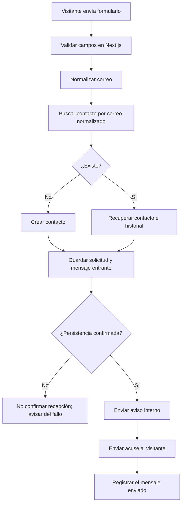

# Flujo de contacto y seguimiento de Multisoluciones Web

Este documento registra el comportamiento aprobado para el formulario, la base de datos y n8n. Los cambios se validan primero con datos ficticios y se publican en el servicio aislado de Multisoluciones Web. El sitio anterior y los servicios de Rescuvo/Mailcow quedan fuera de los cambios.

## Objetivo

Evitar tratar a una persona recurrente como cliente nuevo y evitar perder el contexto de lo que pidió o de lo que ya se le respondió. Cada envío debe relacionarse con un contacto y conservarse como parte de un historial ordenado.

## Regla principal de identidad

Antes de crear un contacto o guardar una solicitud, el flujo debe buscar el correo de quien envía el formulario:

1. Validar los campos en el servidor.
2. Normalizar el correo con recorte de espacios y conversión a minúsculas. No eliminar puntos ni sufijos `+` específicos de proveedores; esas transformaciones podrían unir direcciones que no son equivalentes.
3. Consultar la base de datos por el correo normalizado.
4. Si no existe, crear el contacto.
5. Si existe, recuperar su historial y reutilizar ese contacto.
6. Guardar la solicitud y el mensaje recibido, vinculados al contacto, con fecha y hora.

La base de datos deberá imponer unicidad sobre el correo normalizado para evitar contactos duplicados si dos envíos simultáneos llegan antes de que termine la primera búsqueda. Un reintento técnico de la misma entrega tampoco deberá duplicar la solicitud.

## Primer flujo: guardar el primer formulario

La persistencia ocurre antes de enviar el acuse. El sistema no debe decir que recibió correctamente una solicitud si no confirmó que quedó guardada. La respuesta automática inicial será un acuse de recibo, no una propuesta comercial ni una contestación sustantiva a la petición.

## Conceptos de información

La base dedicada `multisoluciones_web` usa el PostgreSQL ya existente en el VPS de n8n/SistemaSaaS, con el rol exclusivo `multisoluciones_web_app`. No se reutiliza la base interna de n8n ni la de SistemaSaaS. Las tablas existentes `contacts`, `requests` y `messages` conservan contactos, solicitudes y mensajes.

La estructura conceptual es:

- **Contacto:** una persona o negocio identificado por su correo normalizado; conserva fechas de primer y último contacto.
- **Solicitud:** un tema o necesidad concreta asociada al contacto, con estado propio. Un mismo contacto puede tener varias solicitudes.
- **Mensaje:** cada entrada o salida, asociada al contacto y, cuando corresponda, a una solicitud. Conserva dirección, canal, fecha y contenido necesario para el historial.
- **Preferencia y consentimiento de contacto:** elección explícita de llamada, WhatsApp o continuar por correo, con fecha y solicitud a la que aplica. El teléfono solo se pide si se elige llamada o WhatsApp.

No se debe confundir la cantidad de mensajes con la cantidad de solicitudes: una persona puede enviar muchos mensajes sobre una sola solicitud, o iniciar temas distintos usando el mismo correo.

## Acuse inicial y elección del canal

Después de confirmar la persistencia, el correo de acuse agradecerá el contacto y explicará que la solicitud está en revisión. También ofrecerá estas opciones explícitas:

- **Llamada:** abrir una página breve con la opción ya seleccionada y solicitar el número telefónico.
- **WhatsApp:** abrir la misma página con WhatsApp seleccionado y solicitar el número correspondiente.
- **Continuar por correo:** guardar esa preferencia sin pedir otro número.

Los botones del correo no pueden enviar por sí solos un campo oculto directamente desde el cliente de correo. Cada botón debe abrir una página breve del sitio asociada a esa solicitud mediante un token UUID aleatorio de un solo uso con vencimiento. El usuario confirma la elección en esa página; un GET nunca modifica datos por sí solo. La opción «llamada» o «WhatsApp» solicita un teléfono; «correo» y «ninguno» no. El servidor valida el token, registra elección, fecha y solicitud, y guarda el teléfono solo cuando aplica. La selección no inicia una llamada ni envía WhatsApp automáticamente: registra la preferencia para el seguimiento manual.

Los valores persistidos son `pending` (todavía no respondió), `email`, `call`, `whatsapp` y `none`. No responder equivale a `pending`, nunca a `none`. Si la persona elige `none`, se envía el acuse de esa solicitud y luego se deja de ofrecer contacto telefónico/WhatsApp; formularios posteriores reciben solo un acuse por correo. Si elige un canal, los formularios posteriores se confirman por correo y se indica que se usará el canal guardado, sin volver a insistir con opciones. La preferencia se cambia solo mediante una nueva elección explícita.

Cada envío del formulario se guarda como una solicitud nueva y se envía siempre un acuse por correo. El aviso interno a `info@multisoluciones.online` incluye la solicitud actual, si el contacto es nuevo o recurrente y el número de solicitud del contacto. La respuesta automatizada es un acuse, no una contestación sustantiva ni asesoría automática.

## Continuidad de solicitudes

En una nueva entrega del formulario, el correo normalizado permite recuperar al mismo contacto aunque hayan pasado días o semanas. Cada envío se guarda como mensaje nuevo. Si es un tema distinto, se asocia a otra solicitud; si continúa un asunto anterior, se conserva la relación con esa solicitud.

En una etapa posterior, las respuestas recibidas por correo se podrán correlacionar mediante los encabezados de hilo (`In-Reply-To` y `References`) y/o una referencia de solicitud. Después de recuperar el historial, el sistema podrá calcular el tiempo desde el último contacto y retomar el contexto. Si no puede decidir con certeza si es continuación o tema nuevo, debe dejarlo para revisión en vez de adivinar.

## Orden de implementación y verificación

1. Confirmar las tablas y restricciones existentes en la base dedicada; aplicar [la migración aditiva](../../database/migrations/001_multisoluciones_web_contact_preferences.sql) para preferencia, token de un solo uso y vencimiento sin tocar otras bases.
2. Ajustar el webhook de ingreso: validar y normalizar, buscar contacto, crear solo si no existe, guardar solicitud/mensaje, determinar el texto de acuse según preferencia y construir enlaces de selección cuando aplique.
3. Enviar un aviso descriptivo a administración y un acuse al visitante solo después de confirmar persistencia. El aviso identifica si es contacto nuevo/recurrente y el número de solicitud; registrar resultados de correo sin incluir secretos.
4. Implementar la página localizada para elegir canal y un webhook separado que valide token, vencimiento y uso único; exigir teléfono para llamada/WhatsApp.
5. Cuando la preferencia quede guardada, enviar a `info@multisoluciones.online` un aviso con nombre, correo, canal y teléfono cuando aplique. Si el token no es válido, no enviar ese aviso.
6. Confirmar en la página que la preferencia se guardó; no mostrar éxito si el servidor no confirma la actualización.
7. Probar en local los casos nuevo, recurrente sin preferencia, recurrente con canal, `none`, token inválido, token vencido, uso duplicado y fallo de base/correo. Usar únicamente datos ficticios.
8. Publicar el flujo y el sitio aislado después de superar las pruebas; mantener intactos el sitio anterior y los servicios ajenos a esta app.

Las etapas se implementarán y comprobarán por separado. Por ahora no se agrega análisis con IA, blog, comentarios, llamadas automáticas ni envío automático de WhatsApp.

## Fuera de alcance de esta fase

- Análisis con IA, respuestas comerciales automáticas, blog/comentarios, importación de respuestas del correo, llamadas automáticas, WhatsApp automático y bot de Telegram.
- Interpretación automática de si un tema es nuevo o continuidad; cada nuevo envío del formulario se registra como solicitud nueva en esta fase.
- Cambios al VPS de Rescuvo/Mailcow, al sitio anterior, SSL o Nginx. El sitio nuevo usa el servicio aislado ya configurado para el dominio.

## Estado actual

La página localizada de selección y la acción de servidor están implementadas y desplegadas en el servicio aislado de Multisoluciones Web. En producción, `CONTACT_MODE=n8n-live` habilita únicamente los webhooks publicados de ingreso y preferencias; en local se conserva el modo simulado y `n8n-test`. Las URLs se mantienen en el `.env.production` del servicio y no se guardan en el repositorio. La migración aditiva de preferencias/idioma está aplicada en la base dedicada. El flujo n8n está publicado y guarda la selección de un solo uso, confirma el resultado al formulario y, solo cuando la actualización es válida, envía por la credencial SMTP Mailcow una notificación a `info@multisoluciones.online` con el canal elegido y el teléfono cuando aplica. La atribución automática de la plataforma está desactivada en los tres nodos de correo.

El formulario ya envía el idioma activo en el campo oculto `locale` (`en`, `es`, `ko` o `pt`), y la acción de servidor lo incluye en el JSON del webhook. n8n usa ese valor para escoger solo entre dos idiomas de respuesta: `es` produce el acuse en español; `en`, `pt` y `ko` producen el acuse en inglés. El asunto del acuse también es dinámico y queda en el mismo idioma. El aviso interno a administración permanece en español y conserva el mensaje del cliente sin traducir.

Verificaciones realizadas con datos ficticios: envío inicial y aviso/acuse aceptados por Mailcow; cliente recurrente reconocido con preferencia previamente guardada; selección de WhatsApp guardada en PostgreSQL y confirmada por el formulario; correo interno aceptado por Mailcow; reintento del mismo token rechazado sin enviar un segundo aviso. El 2026-10-04 se probó el sitio público de extremo a extremo: el formulario en español recibió confirmación, el aviso interno registró el contacto recurrente y la solicitud #3 (anteriores: 2), y llegaron al buzón de `info@multisoluciones.online` el aviso y el acuse en español. Las rutas públicas `/`, `/es`, `/pt` y `/ko` devolvieron el idioma oculto correspondiente; la página localizada de preferencias respondió HTTP 200. `npm run lint` y `npm run build` pasaron en local; la compilación de producción también pasó en Linux.

El formulario público ya está conectado al flujo publicado. La versión anterior se conserva en `/opt/multisoluciones-web-v2-pre-live-20261004` y en el respaldo `/opt/multisoluciones-web-v2-pre-contact-live-20261004.tar.gz` para una reversión controlada. No se modificaron Nginx, SSL, el sitio anterior ni Mailcow. Los nombres de nodos describen función y destinatario (por ejemplo, `Buscar Clientes existentes`, `Notificar a administración - Multisoluciones Web`, `Enviar acuse de recibo al cliente`, `Guardar preferencia y validar token`, `¿Se guardó la preferencia?` y `Notificar a administración - Preferencia de contacto`). El usuario confirmó la recepción del correo y la notificación de Telegram en pruebas de producción; el 2026-10-06 se limpió el contacto ficticio de prueba.

Estado posterior — 2026-10-06: se publicó una plantilla HTML de ancho completo, con paleta menta y escape de valores para los avisos administrativos de nueva solicitud y preferencia. Un envío ficticio posterior al cambio devolvió éxito, registró el acuse al cliente y confirmó Telegram `sent`; falta revisar visualmente el aviso administrativo en la bandeja y probar el correo de aviso de preferencia con la nueva plantilla. El acuse del cliente ya incluía HTML y alternativa de texto. El receptor IMAP general está publicado, pero la respuesta automática de revisión a remitentes nuevos legítimos, la validación en vivo de los filtros/correlación y un límite durable de tasa para el endpoint público siguen pendientes; el proyecto aún no está terminado al 100%.
