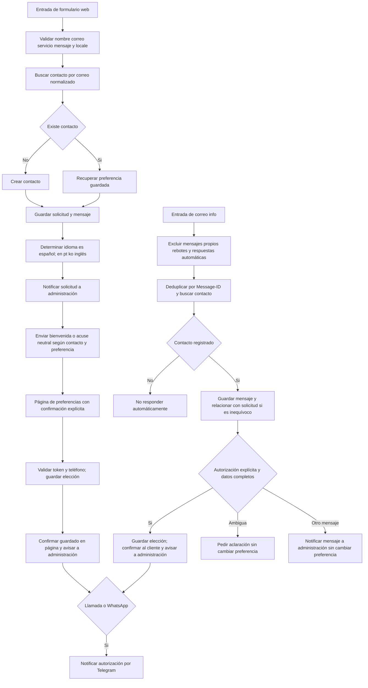

# Contacto web, respuestas por correo y avisos Telegram

Diseño aprobado en conversación el 2026-10-04. Amplía la fase documentada en `docs/contacto/README.md`; la exclusión anterior de correo entrante y Telegram deja de aplicar a esta fase. No incluye IA ni respuestas comerciales automáticas.

## Recorrido

## Reglas del formulario

- Nombre, correo, servicio y mensaje obligatorios. Locale permitido: en, es, pt, ko. El idioma procede del formulario, no de inferencia del texto.
- Buscar contacto antes de crearlo; correo normalizado sin eliminar puntos ni sufijos de proveedor. Unicidad en base de datos.
- Cada entrega distinta guarda una solicitud y su mensaje. Un reintento de la misma entrega no crea otra solicitud.
- Primera vez: bienvenida y acuse, con opciones de contacto. Contacto recurrente: «Gracias por volver a escribirnos. Hemos recibido tu mensaje y lo estamos revisando», sin asumir tema ni petición.
- pending: ofrecer canales al responder al nuevo envío, sin recordatorios espontáneos. email: continuar por correo. call/whatsapp: indicar seguimiento por canal guardado cuando un asesor esté disponible. none: solo acuse; no seguimiento ni nuevas ofertas.
- Persistir antes de confirmar recepción. Fallos posteriores de notificación deben quedar registrados y poder reintentarse sin duplicar solicitudes ni mensajes ya enviados.

## Preferencias

Página existente como vía principal; correo de respuesta como alternativa. Opciones email, call, whatsapp, none. Teléfono y código de país para llamada/WhatsApp. Token aleatorio con vencimiento y uso único; GET no modifica datos. Registrar canal, número cuando corresponda, fecha, origen y solicitud. Confirmar éxito únicamente tras actualización válida. No iniciar llamadas ni WhatsApp automáticamente.

## Correo entrante

Nuevo receptor separado de los flujos antiguos. Reutilizar credenciales autorizadas, no reactivar automatizaciones anteriores. Procesar exclusivamente contactos existentes. Excluir avisos generados por el sistema, rebotes, mensajes automáticos y duplicados; no depender solo del asunto.

Correlacionar mediante Message-ID, In-Reply-To y References registrados; referencia de solicitud como apoyo. Si hay varias solicitudes posibles, conservar el mensaje para revisión sin asignarlo arbitrariamente. Número por sí solo no autoriza ni identifica canal. Cambiar preferencia únicamente ante elección inequívoca. Si falta canal/número, pedir aclaración. Preguntas o agradecimientos se guardan y notifican sin análisis IA ni cambio de consentimiento.

Idioma de respuesta: contexto de solicitud identificada; en ausencia de contexto, idioma guardado del contacto. es español; resto inglés. Avisos internos en español y mensaje original intacto.

## Telegram

Usar la credencial existente del bot @multisoluciones_enlinea_bot y verificar chat destinatario. Notificar autorizaciones de llamada/WhatsApp válidas, de contactos nuevos o recurrentes: nombre, canal, número, servicio y referencia de solicitud. No incluir tokens de preferencias ni secretos. Si Telegram falla, la elección permanece guardada y el aviso se registra como pendiente; no pedir al cliente repetirla.

## Datos y operación

Base dedicada multisoluciones_web; cambios aditivos, con respaldo antes de migrar. Contactos, solicitudes y mensajes separados; registrar consentimiento, identificadores de correo, dirección del mensaje y estados de notificación. Limpiar solo datos identificados de pruebas de este proyecto, después de respaldo; no borrar bases ni datos ajenos.

## Orden y aceptación

1. Inventariar esquema y exportar respaldo de flujo actual; verificar flujos antiguos inactivos y credenciales existentes sin exponer secretos.
2. Ajustar textos, estados y persistencia del formulario/preferencias. Probar cliente nuevo y recurrente para pending/email/call/whatsapp/none, y los cuatro locales.
3. Incorporar correlación, deduplicación y filtros del receptor de correo; probar desconocido, mensaje propio, rebote, automático, duplicado, autorización completa, incompleta y respuesta ordinaria.
4. Integrar Telegram y probar entrega al destinatario verificado, sin alterar otros bots.
5. Verificar token vencido/usado/inválido, fallos de base y notificación, y reintentos. Usar datos ficticios en buzones autorizados.
6. Publicar únicamente tras pruebas de ambos recorridos; conservar exportación anterior y documentar reversión. Mantener diseño, rutas, SSL y servicios ajenos.
