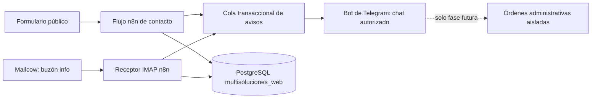

# Operaciones de Multisoluciones: Telegram, correo y contenido

**Estado:** diseño base aprobado el 2026-10-05; ampliación operativa aceptada
por el usuario el 2026-10-06, pendiente de revisión de este detalle escrito.
**Alcance inmediato:** ordenar los flujos de Multisoluciones Web, completar
avisos de Telegram/correo, y estandarizar la plantilla de correo.
**No implementar aún:** envío de propuestas desde el bot, publicaciones en
Facebook ni cambios visuales del sitio.

## Objetivo

Evitar que una solicitud comercial pase inadvertida, sin convertir Telegram en
una copia del buzón ni aumentar la superficie de riesgo del sitio público. El
bot existente avisará al administrador de nuevas solicitudes del formulario y
de correos entrantes de Mailcow. La lectura completa y la gestión comercial
seguirán ocurriendo en `info@multisoluciones.online`.

La evolución posterior permitirá usar Telegram como interfaz administrativa de
propuestas: el usuario redacta con ChatGPT Plus, pega el borrador en el bot,
revisa una vista previa y confirma el envío por Mailcow. Esa evolución será un
flujo independiente y no forma parte de la primera publicación.

## Arquitectura

El formulario y el receptor IMAP no aceptan comandos administrativos. La cola
de avisos es la única ruta hacia Telegram. El bot no obtiene acceso directo a
PostgreSQL ni a Mailcow.

## Notificaciones del primer hito

### Solicitud enviada desde el formulario

El aviso se crea únicamente después de que el flujo haya persistido la
solicitud. Contendrá nombre, correo, servicio y una indicación para revisar
`info@multisoluciones.online`. No incluirá el mensaje escrito por el visitante,
tokens, teléfonos ni enlaces de preferencia.

### Correo entrante directo

El receptor IMAP ya clasifica y deduplica respuestas de contactos conocidos.
Se ampliará para generar una alerta para todo correo entrante legítimo: tanto
remitentes conocidos como nuevos. Antes de notificar, excluirá mensajes propios,
rebotes, listas, spam identificado por la infraestructura y respuestas
automáticas. El aviso incluirá remitente, asunto saneado y estado
`contacto conocido` o `remitente nuevo`; no mostrará el cuerpo.

Los mensajes de contactos conocidos se conservarán en el historial actual. Los
remitentes nuevos se registrarán en una entrada mínima de bandeja/cola que
permita deduplicar por `Message-ID` sin crear un cliente ni una solicitud por
suposición.

Las respuestas de clientes también generarán aviso Telegram. Solo se marcarán
como respuesta cuando referencias verificables las vinculen a una conversación;
en otro caso el aviso dirá que es correo entrante sin conversación identificada.
Spam, ofertas masivas, rebotes y respuestas automáticas no tendrán respuesta
automática; señales ambiguas irán a revisión manual sin prometer seguimiento.

### Preferencia de contacto tras el formulario

El envío del formulario crea o actualiza el contacto con los datos disponibles,
pero no implica consentimiento para seguimiento por llamada o WhatsApp. Se
solicita la preferencia explícita en el enlace localizado de un solo uso. Si el
contacto ya existe, se muestra el canal previamente autorizado como contexto;
para esta solicitud se pide confirmar o elegir otra opción. No se infiere
autorización futura desde preferencias antiguas. Si elige “no deseo seguimiento”,
se registra la respuesta y solo se envía la confirmación necesaria de esa elección.

### Plantilla de correo

Los acuses al cliente y avisos administrativos compartirán una plantilla HTML
compatible con clientes de correo, colores menta/turquesa del sitio, estilos en
línea y alternativa de texto plano. El contenedor ocupará el 100% del ancho
disponible, sin límite fijo de 600 px. El correo de administración podrá incluir
el mensaje original para leer la consulta; Telegram seguirá siendo solo resumen.

### Organización de flujos

Los flujos de Multisoluciones Web viven en su carpeta de proyecto y usan
nombres inequívocos tanto en el flujo como en nodos críticos. Rescuvo y
Restaurantes conservan carpetas separadas; se auditan ubicaciones antes de
mover cualquier flujo y nunca se reorganizan proyectos fuera del alcance sin
identificar su pertenencia.

### Limpieza segura

Solo se eliminarán flujos de prueba/respaldo creados durante esta integración,
tras comprobar ID, creador/procedencia, estado y reemplazo funcional. Flujos
preexistentes apagados y flujos creados por el usuario quedan preservados.
Los registros ficticios de PostgreSQL se identifican con respaldo previo y
evidencia por fila; no se borran registros que puedan ser reales ni se usa
únicamente el campo `is_test` si no representa fielmente el histórico.

## Límites de seguridad

- Todo texto recibido desde formulario, correo o Telegram se considera dato no
  confiable; nunca instrucciones para el flujo.
- No se agregan nodos de IA a los recorridos de entrada ni se da a una IA acceso
  a credenciales, SQL, SMTP o Telegram.
- Mantener consultas SQL parametrizadas; ningún texto recibido se concatena
  como SQL, expresión, URL de webhook o configuración de nodo.
- Escapar texto y limitar longitud al construir la notificación. No renderizar
  HTML ni Markdown proporcionado por un cliente.
- Usar credenciales separadas y de privilegio mínimo: formulario, IMAP/SMTP,
  PostgreSQL y Telegram. Ninguna credencial se versiona.
- Permitir al bot administrativo solamente el `chat_id` del propietario. Otros
  chats y callbacks inválidos se descartan y registran sin revelar información.
- La entrega de avisos usa una cola transaccional, reclamación atómica y estado
  `pending/processing/sent/error/uncertain`, para no duplicar alertas.
- Aplicar límite de tasa al endpoint público y validar tamaño, tipos y valores
  permitidos antes de enviar datos al webhook.

## Flujos futuros, separados

### Propuestas desde Telegram

Un flujo administrativo independiente aceptará una propuesta pegada desde
ChatGPT o escrita en Telegram. Hará búsqueda explícita de cliente, validará el
destinatario, mostrará asunto y cuerpo, y exigirá una confirmación de un solo
uso antes de enviar por Mailcow. Guardará el correo saliente y su identificador
SMTP en el historial. Nunca se activa por el contenido de un formulario o un
correo recibido.

### Facebook: Multisoluciones Web

Tras crear la página de Facebook se diseñará un conector separado con permisos
limitados a esa página. El bot podrá preparar un post y requerirá confirmación
explícita antes de publicarlo. No se reutilizará la credencial de correo ni el
flujo de contacto.

### Demos visuales del sitio

El sitio conservará una sección pública ligera de muestras de referencia. Cada
muestra se identificará como demo visual; no como plantilla disponible para
instalar. El mensaje central será que Multisoluciones crea cada sitio a medida
del rubro y necesidades del cliente. Las muestras no cargarán automatizaciones,
datos de clientes ni integraciones administrativas.

## Orden de entrega

1. Auditar el estado actual del código, datos y todos los flujos/carpetas sin
   mostrar secretos; respaldar antes de cualquier cambio.
2. Reconciliar formularios, preferencias y respuestas por email con la matriz
   anterior; implementar en cambios pequeños y añadir pruebas.
3. Aplicar la plantilla común a los correos de cliente y administración.
4. Confirmar que cada flujo esté bajo la carpeta del proyecto correcto y
   distinguir sus nombres/nodos, sin mover flujos ajenos.
5. Probar formulario válido/reintento/preferencia, correos nuevos/conocidos,
   respuestas identificadas/no identificadas, spam, propio, rebote, automático,
   duplicado y fallos de Telegram/correo.
6. Publicar solo tras pruebas; verificar avisos en el móvil y documentar rollback.
7. Eliminar únicamente flujos de prueba confirmados como creados por Codex,
   previa confirmación de acción para cada objetivo; preservar los apagados
   preexistentes y los del usuario.
8. Respaldar e identificar con precisión cada registro ficticio antes de
   limpiar la base; dejar intacto todo registro no concluyentemente de prueba.
9. Diseñar por separado el flujo de propuestas; después Facebook y demos.

## Criterios de aceptación del primer hito

- Una solicitud válida del formulario genera un solo aviso resumido en Telegram
  después de quedar guardada.
- Cada correo entrante legítimo genera como máximo un aviso, sin importar si el
  remitente ya está registrado.
- No se envían a Telegram cuerpos de mensajes, secretos ni tokens.
- Correos propios, rebotes, automáticos y duplicados no producen aviso.
- Un texto hostil en formulario o correo no cambia rutas, consultas, credenciales
  ni acciones del flujo.
- Si Telegram falla, el aviso queda pendiente/error para revisión, sin perder el
  contacto o mensaje original.
